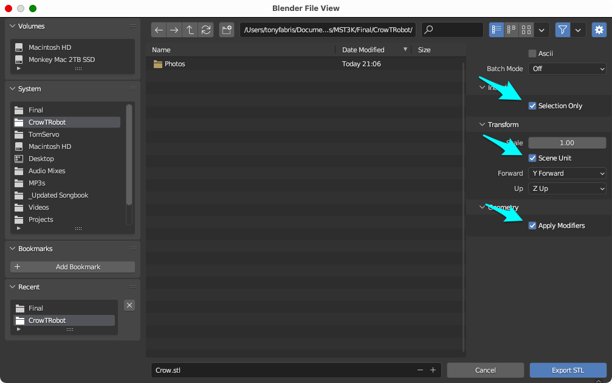
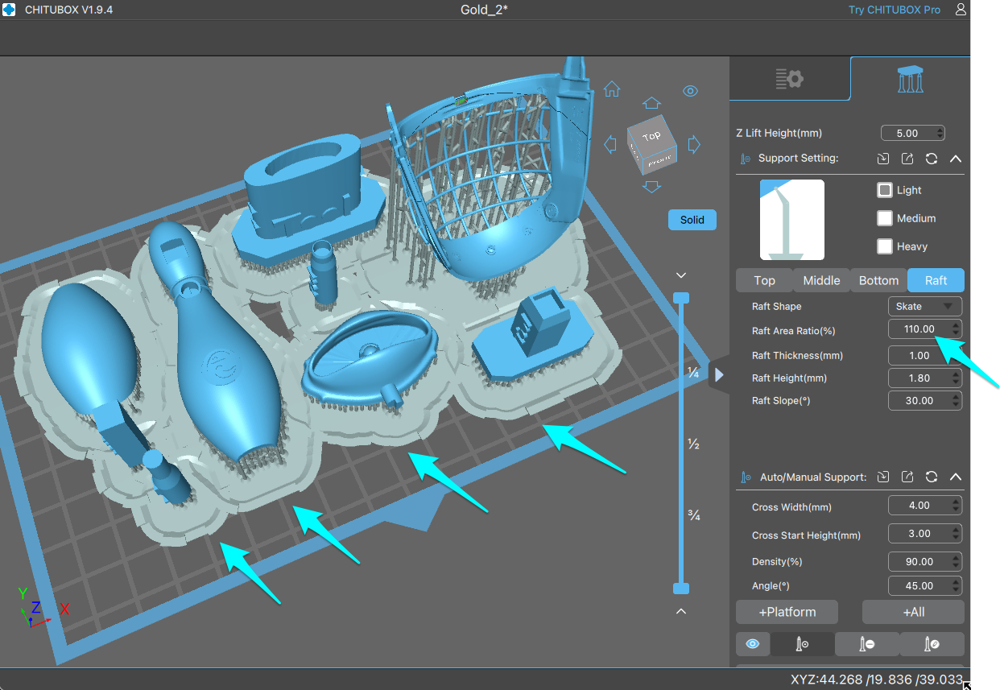

Crow T. Robot - Resin Print Model
=================================
&copy; 2024 by Tony Fabris

https://github.com/tfabris/CrowTRobot

|  |  |
| ----------------------------------------------|-----------------------------------------------|
|  |   |

A project for resin-printing a small model of a character from Mystery Science Theater 3000. Not intended for making a full size puppet. Final size of model is approximately 16cm (6½ inches) tall. (I have also done Tom Servo, located [here](https://github.com/tfabris/TomServo).)

This is a full model ***kit***, which requires painting and assembly. Model building skills are required. If you've built plastic car models and airplane models, this should feel familiar to you. The final result should look very realistic if it's painted and assembled well.

Required materials:
-------------------

### Hardware:
  
  - A 3D resin printer and a wash/cure station. I'm using an Anycubic Photon M3, but other resin printers will work too: https://www.anycubic.com
  - The parts are arranged to fit on the 7.6-inch screen of the Photon M3. If yours is smaller, you'll need to print your parts in more batches of fewer parts each.
  - Crow should be printed in "ABS-Like" black-colored resin if possible. His parts are thin and fragile, so using this type of resin will reduce the tendency for the parts to shatter. I'm using Sunlu ABS-Like Black resin: https://www.amazon.com/SUNLU-3D-Printer-Resin-Photopolymer/dp/B0B12DRYDY

### Software:

  - Blender - I'm using v3.6 at the moment): https://www.blender.org/
  - A slicer program - I'm using Chitubox Basic v1.9.4 at the moment: https://www.chitubox.com/en/download/chitubox-free
  - The source files for this 3D model: https://github.com/tfabris/CrowTRobot/archive/refs/heads/master.zip

### External Materials:

You'll need to source some external materials to complete this model.

#### • Arm and Jaw Hinge Pins:

  - Find some straight pins, silk/satin "fine" gauge, which are 0.64mm (0.0255in) diameter, you will cut these to length. You may also be able to go slightly larger, and use dressmaker pins "medium" gauge, if they are about 0.72mm (0.0285in) diameter (medium dressmaker pins can come in different thicknesses depending on their plating). You'll need about 25 of these, a dozen for each arm/shoulder assembly and one for the jaw.

#### • Paints:

Most of the paints can be substituted with similar items, however, it's important to source the canonical colors directly.

  - Testors 1642T Lime Gold Metal Flake spray paint. (Canonical screen-accurate color.)
  - Testors 1542 Gold Metal Flake bottle paint. (Canonical screen-accurate color.)
  - Rust-Oleum 327907 2X Ultra Cover Paint+Primer, Metallic Aluminum spray paint.
  - Rust-Oleum 327914 2X Ultra Cover Flat White Primer spray paint.
  - Rust-Oleum 342571 Fluorescent Yellow spray paint - "Yellow Bright Neon Color"
  - Testors 1146 Metallic Silver bottle paint.
  - Testors 1147 Gloss Black bottle paint.
  - Testors 1149 Flat Black bottle paint.
  - Testors 1163 Flat Gray bottle paint.
  - Testors 1145 Gloss White bottle paint.

#### • Glue and other materials:

  - Loctite brand super glue, "Ultragel Control" version.
  - X-Acto knife, emery boards, sandpaper, nitrile gloves, isopropyl alcohol.
  - A pair of flush-cut wire cutters. The "flush" part is the important part. Example: https://www.amazon.com/dp/B00FZPDG1K
  - Some stiff solid-core wire, stripped, 22 AWG (0.64mm) or thinner. Used for hanging certain parts on during spray painting.
  - Scotch/3M brand Removable Mounting Putty. Used for making joints more sticky. Example: https://www.amazon.com/dp/B07KPLJ8XP

Where These Meshes Originated:
------------------------------

Some of the parts were originally from a set of 3D models by @Pack_512, found on the Printables.com web site, then modified:

  - https://www.printables.com/model/68157-random-crow-t-robot-parts

The soap dish is originally from user supinemonkey on Thingverse.com, then modified:

  - https://www.thingiverse.com/thing:4797742

The MST3K Logo base is originally from user fhsumakerspace on Thingverse.com, then modified:

  - https://www.thingiverse.com/thing:4613256/files

Most of these files were originally intended to print full size puppet parts, on a PLA filament printer. However they don't include every part of Crow, and, needed significant modification before they could be resin printed at a small size. For example, certain areas needed to be thickened in order to prevent crumbling when reduced in size. Some parts needed redesigning so that they could assemble with glue instead of screws, and I had to modify most of the places where the parts dovetail together so that they could fit at the smaller size. I modified each of the parts to make them easier to resin-print, paint, and assemble into a model, as well as changing some of the parts to be more screen-accurate and have better geometry in some cases.

The center post, hands, arm noodles, skirt rims, and web were modeled by me, Tony Fabris. I also added the Tupperware Floralier text to the Pack_512 Tupperware panel pieces, and added the Empire logo to the Pack_512 bowling pin parts.

#### Reference Materials:

  - Official MST3K Bot Building Booklet. I got mine from the fan club many years ago (when there was still a fan club), but here is a link to a scanned copy that someone put on dropbox:
    - https://www.dropbox.com/s/sl6pzz7m48q7dxr
  - You can google for photos and screen shots on the web. Good example sources:
    - https://mst3k.fandom.com/wiki/Crow_T._Robot?so=search&file=CrowTRobot.jpg 
    - https://forums.mst3k.com/t/bot-building-crow/21138
    - https://propstoreauction.com/lot-details/index/catalog/397/lot/138213
  - The MST3K channel on YouTube:
    - https://www.youtube.com/@mst3k
  - These particular YouTube videos:
    - https://www.youtube.com/watch?v=7FsXqidZgG4
    - https://www.youtube.com/watch?v=C3aQ9QuX7KQ
    - https://www.youtube.com/watch?v=7fs5auCDgow
    - https://www.youtube.com/watch?v=7VP9y5gsqLk
  - I have also placed some reference photos in this archive.

Exporting Models From Blender for 3D Printing:
----------------------------------------------

Instructions below are for Blender version 3.6. If you are running a later version, it might work a little differently. I haven't tried this on Blender 4.2 yet.

Keep the parts in their arranged positions, in the blender file, when you export. **Do not tilt the parts,** they are already in their printing positions. If you have a smaller printer than I do (mine has a 7.6-inch screen), then export the pieces in more groups of fewer pieces, but keep them in the same orientations.

#### Open the file:

  - Open the "Crow.blend" file in Blender.

#### Ensure correct scaling: 

  - Ensure that "Unit Scale" of the blender file is set to 2.275:
    - Select the "Scene" properties panel. Should be the lower right hand panel in the UI, select its fifth icon which is "Scene", expand the "Units" section and ensure the Unit Scale is 2.275.

#### Export each color group:

You will be making multiple selections to export separate groups of objects, to paint them in groups of the same color.

  - In the main viewport window, group-select the objects arranged in each color group, and export each group after selecting.
  - The color groups are arranged for a printer with a 7.6-inch screen. If yours is smaller, then you'll need to export the pieces in more groups of fewer pieces each.
      - Gold objects 1:
        - Chest upper and lower.
        - Vase upper and lower.
      - Gold objects 2:
        - Mouth upper and lower.
        - Soap Dish.
        - Web.
        - Five masking tools:
          - Soap Dish Eye Mask.
          - Soap Dish Post Mask Tool Female.
          - Soap Dish Post Mask Tool Male.
          - Web Mounting Hole Mask Tool.
          - Web Post Mask Tool.
      - Gold objects 3:
        - Arm and shoulder parts:
          - Long Bone 1-4.
          - Short Bone 1-4.
          - Hand 1-2.
          - Shoulder Joint outer 1-2.
          - Arm joint plates shoulder 1-2.
          - Arm joint plates elbow 1-2.
          - Arm joint plates wrist 1-2.
      - Flat Black objects:
        - Center Body Post.
        - Pupils.
        - Shoulder 1-2.
        - Shoulder Joint Inner 1-2.
        - Shoulder Washer 1-2.
        - Upper Vase Edge Ring.
        - Lower Vase Edge Ring.
        - Arm Noodle Short 1-2.
        - Arm Noodle Long 1-2.
      - Gloss Black objects:
        - Shoulder hose 1-2.
        - Neck Hose.
        - Chest Hose.
        - Textured Base.
      - Yellow objects
        - Eyeballs
        - Eyeball Mask
  - Make sure ONLY the desired objects are selected (one color group only) before exporting.
  - File, Export, .STL, export each of the color groups above as a separate file.
  - Make absolutely sure these tickyboxes are ticked:
    - "Selection Only" ← IMPORTANT
    - "Scene Unit" ← IMPORTANT
    - "Apply Modifiers" ← IMPORTANT

    |  |
    | -----------------------------|

  - Export each group as their own STL files:
    - Gold 1.stl
    - Gold 2.stl
    - Gold 3.stl
    - Flat Black.stl
    - Gloss Black.stl
    - Yellow.stl

Slicing:
--------

You may use any slicer to process the files. Instructions here are for Chitubox Basic v1.9.4. If you are using another slicer, find the equivalent features. 

#### Create a new project in your slicer and then:

  - Import one of the color group STL files that you exported.
  - Ensure the parts fit on the print bed and are centered.
  - Keep the parts in their arranged positions when slicing. **Do not tilt the parts.** The parts were already in their correct printing orientations in the original blender file.
  - In the slicer, save the project file, in the slicer's file format.
  - Switch to the support editing screen in your slicer.
    - Select the "Light" version of the supports.
    - Edit the "Raft" or "Base" or "Platform" parameters by selecting the appropriate screen in the support editor.
    - Increase the size of the Rafts/Bases/Platforms. Some slicers will give this as a percentage value, others will have you enter a specific size. Make them larger than the default.
    - This is to make each color group's rafts run together, so that the parts all sit together on one large raft. This makes them easier to handle and makes it possible to spray paint each color group as a single unit. Adjust this number as needed, so that the rafts are big enough to **overlap** each other, but **not** so big that they exceed the print bed size.

    |  |
    | -------------------------------|

    - Press the appropriate button in your slicer to auto-add rafts and supports ("+All" in Chitubox), adjust the raft size again if needed, and press the button again if you changed the raft size.
    - Edit the supports (You may need to rotate the view, to view the model from the bottom, to edit the supports). Goals when editing supports:
      - Where possible, attach supports only to places which are less visible in the final model. Delete supports which will mar the finish of the visible portions of the model, but only if you can safely delete them without causing a printing problem.
      - Also make sure that the smallest and thinnest parts have enough supports. Even the tiniest pieces should have at least 4-6 supports, so that the part remains stable while printing. With too few supports, the objects tend to disconnect from the supports during printing, causing the resulting parts to be curled. Fix this by adding additional supports to thin and tiny parts.
      - The mesh wire part of the web needs fewer supports than you might think. One support per wire per gap should be enough: Each place where one wire crosses another, make sure that there is one support on the wire in the gap between each of the crossing points in each direction, and you should be good. This will help make removing this from the supports a little less tedious.

      

      - Add additional supports near the ends of long straight pieces such as the arm bone pieces and the center column piece. These pieces tend to curl and warp during printing if you don't pepper them with supports.
      - Add additional supports to any places where the piece is printing a flat area which faces down towards the print bed, such as the soap dish. If you don't add lots of supports to flat areas, the print will seem "blobby" on the flat area, an effect caused by wide stretches of paper-thin flat resin which is flexing up and down during the print process.
      - Rein in any supports which are on the outer fine edges of things which don't actually need the supports to be so far out on the edge. I'm speaking of any supports which are at the thin edge of any pieces where the dots would become visible and obvious after printing and painting, such as the Tupperware panel edges and the bowling pin edges. Rein those supports in, so that they don't make little dots on the visible parts of the edges, or else you'll need to be sanding those dots off yourself. Obviously don't move them so far that you ruin the print, just move them inward a tiny bit, just barely inside the edge.
  - When done editing supports, save the slicer project file again.
  - Go into your slicer's final slicing screen.
     - Chitubox will prompt you for your exposure time settings at this point. Other slicers may have different methods for editing the exposure settings. Change the settings as needed, based on your printer and resin. 
       - I personally set my exposure time to 3 and my bottom-layer exposure time to 20, but your printer and resin may differ.
  - Press the final save or commit button in your slicer to generate the ".pm3" file for the printer.
  - Repeat the process of exporting and slicing, for each color group of parts.

Printing:
---------

#### Print the .pm3 files on your resin printer:

- Print each of the color groups. 
- Print all parts in "ABS-Like" black-colored resin. I'm using Sunlu, but other ABS-Like, black-colored resins may work. The ABS-Like feature is important, so that the parts have the required flexibility after printing.
- Rinse/dry/cure the parts while still on the supports.
- Spend extra time curing the arm bone parts and the center body post part, hopefully reducing their tendency to warp over time.
- After curing, leave the parts on the supports and rafts, to make them easy to paint.

Painting:
---------

Prime and paint most of the parts while they are still on the supports and rafts (except where noted below), so that they are easier to handle. In addition to ensuring that each color group prints together on the same raft, I also like to glue a popsicle stick to the bottom of each raft, so that I have a handle to hold during spray-painting.

Make sure to thoroughly remove any specks of resin or dust caused by any trimming and sanding you have done. The tiniest specks will show up when the model is painted. I blow everything clean with an air compressor before painting.

#### Painting:

- Eyes:

  The eyeballs have diamond-shaped inner cavities where the pupils go, and the cavities should be left unpainted. A masking tool has been included so that you can spray-paint the eyeballs without getting paint in the inner cavities. For best results:

    - Print the model using black-colored 3D printing resin.
    - After curing, remove the eyeballs from the supports, and clean up the support dots from their back side with an X-Acto. Make sure to carefully clean all trimmings and dust off of the part.
    - Locate the eyeball masking tool. It should be part of the yellow group of parts. It has two diamond-shaped rods, similar to the pupil assembly. Leave the tool on the support raft to make it easier to handle while painting.
    - Slide the eyeballs onto the tool, with their "good" side (the side that didn't have support dots) facing up. See photos below.
    - All of the the fluorescent yellow spray paints that I tried are translucent, so your choice of primer will affect how good the yellow looks. I recommend that you prime the eyeballs with flat white spray paint first, allow it to dry fully, and then paint with bright fluorescent yellow spray paint.
    - Wait until the fluorescent yellow is fully dry before removing the eyeballs from the masking tool.
    - When removed, the masked inner cavities inside the eyeballs should have remained unpainted, so that the pupils can be cleanly and easily inserted during assembly. If any paint ended up inside the cavity after removing it from the mask, try to carefully pull it out of the cavity with a clean toothpick. Take great care not to mess up the crisp yellow diamond-shaped edges around the pupil cavities.
    - Note that the pupils are in a separate color group, the "flat black" color group, and should be left unpainted; the black resin should be enough. If you do decide to paint the pupils black, make sure to paint only their front faces, and leave their shaft and back side unpainted (and do the painting before inserting the pupils into the eyeballs).

|  |  |
| ---------------------------------|------------------------------------------|
|  |  | 

- Soap Dish Eyelids:

  The inside of the soap dish (Crow's eyelids) needs to be black, its back side needs to be cleaned up before painting, and its bottom post must be kept unpainted. To assist with painting, two mask tool parts are included in this model, to help mask the correct places on the soap dish. For easiest painting and best results, do the following:

    - Print the model using black-colored 3D printing resin.
    - After curing, remove the soap dish from the supports, and clean up the support dots from its back side (the flat side) using an X-Acto and fine sandpaper. The back side of the soap dish should be made very smooth. Make sure to carefully clean all trimmings and dust off of the part after sanding it (I use isopropyl alcohol and an air compressor).
    - Put the soap dish onto the 3D-printed eye masking tool. The tool has an oval cross-section and fits perfectly inside the eyelids. Leave the tool on the supports, alongside the other gold pieces in that group.
    - The soap dish and the tool are directional, I have added some "this side up" arrows on the tool. Align those arrows so they point in the "up" direction on the soap dish ("up" is opposite its mounting post).
    - Push the soap dish onto the eye masking tool until it seats into place.
    - Locate the second masking tool, a cylindrical tool with a hole in one end. Push that tool onto the soap dish's post. If it doesn't fit tightly enough to stay in place while painting, then use some removable mounting putty, or some other temporary adhesive, and make sure the putty doesn't protrude around the edges of the masking tool. When spray painted, part of the post will remain exposed and will be painted gold, while the tip of the post will be masked by the tool. See photos below.

|  |  |
| --------------------------------------------------------|--------------------------------------------------------|

- Upper mouth:

  The inner surfaces of the bowling pin mouth need to remain unpainted (black resin), and two attachment holes on the top should also remain unpainted. 
  
    - The inner mouth areas will naturally remain unpainted during the spray painting process (below) because they are facing down towards the raft and should also contain a forest of support sprues from the slicer program. 
    - The holes for the soap dish post and the web mounting post need to be masked. Two tools have been included for this purpose. One is a cylindrical tool with a tapered end, which fits into the soap dish mounting hole, the other is a square tool which fits into the web mounting hole. Remove these tools from the supports and insert them into the holes in the upper mouth. If they don't stay in place well enough to tolerate spray painting, use some removable mounting putty, or some other temporary adhesive, to keep them in place while painting, and make sure the adhesive doesn't protrude around the edges of the masking tools. Leave the upper mouth on the supports for priming and painting. See photos above.

- Web:

  - The web's square mounting post needs to remain unpainted. Locate the masking tool for it, a square post with a square hole on top of the post. Leave this masking tool on the raft and supports, so that you can add the web to it.
  - Remove the web from the supports ***carefully***. The wires in the web are as thin as the 3D printing supports, and can be easily confused. Use photo references, and look closely at the model in Blender and/or your slicer program, to be able to differentiate the supports from the web. I modeled the thing, and I still managed to cut at least one of the web wires on both my prototype and my final model. If this happens to you too, you can glue the cut wire back together, or glue in a length of one of the supports to be a replacement.
  - Clean up the support dots from the web and then make sure to remove all trimmings and dust from the piece using isopropyl alcohol and and air compressor.
  - Insert the web's square mounting post into the masking tool. It will be primed and painted in this position along with the other gold parts. See photos above.

- Arms:

  The gold arm and shoulder parts need to be painted on all sides, and so, can't remain on the supports during painting.

  - Before painting, remove the arm bones, hands, arm joints, and the Y-shaped shoulder joint parts from the supports and clean them up. Clean off the support dots and sand those areas as needed. Make sure to carefully remove all dust and trimmings from the parts, or they will show up when painted.
  - String those parts on a piece of solid wire (22 AWG or thinner). These parts all have tiny holes for the hinge pins, and you can string the wire through those holes. This will allow you to fully prime and paint all sides of these parts without touching them.

  |  |  |
  | ---------------------------------|---------------------------------|

- Gold Parts:
 
  You'll prime and paint all three groups of gold parts together:

  - Leave the Tupperware panel and skirt parts (Chest Upper and lower, Vase Upper and Lower) on the supports for painting.
  - Leave the bowling pin parts (mouth upper and lower) on the supports for painting.
  - The soap dish eyelids and the web should be attached to their masking tools, as described above, on the same raft as the bowling pin parts.
  - The arm and shoulder parts should be on wires as described above.
  - The Testors Lime Gold Metal Flake paint is translucent, so your choice of primer will affect its look. Recommend priming the gold parts with the aluminum colored paint+primer first, then letting them fully dry. The aluminum undercoat brightens the lime gold color and also enhances the metallic sheen of the paint.
  - After the primer coat is dry, make sure to thoroughly shake up the Testors Lime Gold Metal Flake. Shake more than you think should be required. It needs the gold flakes to mix in with the lime color well, and the gold flakes settle a lot.
  - Spray multiple thin coats of the Testors lime gold metal flake, allowing to fully dry between each coat. The lime gold color is very difficult to work with because it has so little pigment. Keep each coat thin, to avoid sags and drips. It might take 2-4 thin coats for the color to look right, if you are putting it on thinly enough.
  - After drying, remove the soap dish and the web from their masking tools, and remove the masking tools from the upper mouth and soap dish. If you used any temporary adhesive to hold the masking tools in place, make sure to fully clean it off.

 |  |  |
 | -------------------------------------------|-------------------------------------------|
 |  |  |
 |  |  |

- Inner surfaces of gold parts:

  - The insides of the bowling pin (beak) and the insides of the Tupperware panels (chest and skirts) should be black. If you printed the model using black-colored resin, depending on how cleanly the supports came off and how much overspray ended up in there, you should be able to get away with not painting the insides of those parts, and just leaving them in the black resin color.
  - The edges of the bowling pin, and the edges of Tupperware parts can be cleaned up by scraping them with an X-Acto knife. Scrape with the blade held slightly more than 90 degrees from the edge, so that it is dragging rather than cutting. Scrape ***slowly*** to reduce chattering which would cause bumpy ridges along the edge. This should give a nice clean flat edge, exposing the black resin color.
  - After scraping the edges, soak a cotton swab with isopropyl alcohol and vigorously rub the edges and the inside surfaces of the bowling pin and Tupperware parts. This should fully clean them up, and give a nice flat black appearance without needing to paint their insides.
  - Don't bother trying to sand away all the support dots on the inner surfaces of the Tupperware parts or the bowling pin. After having just done the edges and the alcohol swab described above, those surfaces should look pretty good, and they're not very visible when the model is fully assembled.
  - Hand-paint the areas around the bowling pin's lower neck post where the spray paint didn't reach. You'll need to use bottle paints, putting on a silver base coat followed by lime gold final color, like you did with the spray paints. While you're doing this, be careful not to get any paint on the inner black surfaces of the mouth, those should remain black. Also try not to get paint inside the lower neck post hole.

 |  |  |
 | -------------------------------------------|-------------------------------------------|
 |  |  |

- Flat black:

  - If you printed the model using black-colored resin, look to see if you can just leave the flat black parts unpainted. Otherwise you can hand-paint the parts with flat black as needed.
  - If you had to paint them, then do not paint (or make sure to remove the paint from) the areas where parts slide into other parts. No paint on:
    - The inner shoulder joint parts where they connect to the shoulder parts.
    - The center body post where it slides through the Tupperware parts and the neck hose part.
    - The pupil shafts and their ball joint.
  - Depending on how much black pigment your resin has in it, the skirt rim rings (the very thin black circles) might not be opaque enough, and might have to be painted flat black anyway.
  - The arm noodles will have a "bad" side on the bottom, where there are a lot of support dots marring the simulated foam surface texture. I was able to clean this surface by using a very coarse emery stick to sand away the support dots with linear strokes, and then just leave the surface coarsely scraped that way, rather than sanding it smooth. Then I thoroughly cleaned the area I'd scraped, by firmly rubbing with a cotton swab generously soaked in isopropyl alcohol. Then I used a black sharpie to blacken the area I'd sanded, and then did even more rubbing with alcohol. The resulting texture came out OK: Not exactly the same as the printed surface texture of the noodles, but it's good enough at that scale. 

  |  |  |
  | --------------------------------------------------------|--------------------------------------------------------|

- Gloss black:

  - Hand-paint four corrugated tubing parts with gloss black: 1 neck piece, 1 chest piece, and 2 shoulder pieces, with special instructions for the neck hose piece, below.
  
  |  |  |
  | --------------------------------------------------------|--------------------------------------------------------|

- Neck Hose piece:

  - The Neck Hose piece should be flat black on the bottom section (the PVC pipe part) and a somewhat glossier black on the top section (the corrugated tubing part). You may choose to leave the bottom section unpainted, in just the black resin, if it looks OK to you.
  - It needs to slide onto the center body post, so do not paint its inside surface.
  - Hand-paint the tiny silver circle on the bottom front. This is tricky to paint cleanly. I have gotten good results by using a toothpick to dab silver paint onto it. If needed, you can stick the clean end of the toothpick into its central hole to clear out the silver paint from the hole.

  

- Base:

  Starting with the black resin base, drybrush progressively lighter shades of gray onto the base, to highlight the textures and the lettering. Look at an episode and try to match the commerical bumper shots of the logo ball.
  - I started by mixing flat medium gray with flat black in a disposable cup, to get a dark gray, and drybrushing that paint onto the base somewhat thickly. 
  - Then I did the same, but with flat medium gray only, drybrushing slightly less thickly.
  - Finally I mixed gloss white with flat medium gray in a disposable cup, to get a light semi gloss gray, and drybrushed that onto the base somewhat thinly, concentrating mostly on the lettering.
  - Use a good brush or a sponge when you do this. I tried it with a paper towel, and it left a lot of lint on the base.

  

Assembly:
---------

Allow the paint to dry thoroughly before assembling. ***Tip:*** Wear nitrile gloves while assembling. The Testors gloss paint still feels tacky and can get permanently fingerprinted even after it's been drying for a couple of days. The nitrile gloves keep your hands from sticking to the paint, and help prevent fingerprints.

Always test-fit parts together before applying any glue. It's no fun to apply glue only to discover you still need to do some trimming.

For glue, I'm using Loctite brand cyanoacrylate, the "Super Gel Control" version. Substitute whatever glue you think is best. The glue you use should have a gel-like consistency, because sometimes you'll be gluing near some hinges, and you want to ensure the glue doesn't run into the hinges. Use the tiniest amount of glue possible, so that the glue does not goosh out from under the parts.

#### Shoulders:

  - Test-fit the inner shoulder joint pieces into the shoulder pieces, do not glue them yet. Make sure they are in the correct direction (pictured below).
  - Test their ability to rotate. They should rotate, but be firm, firm enough to support the weight of the arms.
  - Optional: If the joints are too loose, you can put some kind of sticky substance on the shaft. I'm using Scotch/3M brand Removable Mounting Putty for this task, but you can experiment and find other good substances. Apply it very thinly so that some of it gets into the actual joint. Clean away any putty that smooshes out of the ends of the joint.
  - Once you are satisfied with the fit, glue the shoulder washer end caps onto the joints with a tiny drop of glue. Make sure not to get any glue into the shafts.
  - Optional: Cut a straight pin down to about 7mm length, and glue it into the hole, through the end cap and into the hole in the shaft. Touch up the shiny head of the straight pin with flat black paint.

|  |  |  |
| ---------------------------------|---------------------------------|---------------------------------|  

#### Arms:

  - Arm Orientation:

    - Each arm has two short bones and two long bones. During assembly, keep track of which ones are which:
      - Two short bones for each forearm (wrist to elbow).
      - Two long bones for each upper arm (elbow to shoulder).
    - Each arm has an "up" and a "down" orientation. The black arm noodles go onto each of the "down" bones, one for each forearm and one for each upper arm.
    - The noodles also have short and long versions, short for the forearm and long for the upper arm.
    - Each wrist joint plate has one curved edge and two straight edges. The curved edge aims back towards the elbow.
    - Each wrist joint plate has a straight short side and a straight long side. The straight short side aims up.
    - Each shoulder joint plate has one curved point and two sharper points. The curved point connects to the top upper arm bone.
    - The hands have a specific up/down orientation, visible in the photo references.
    - Each elbow joint plate has a specific up/down orientation, with the long side down.
    - Don't forget the corrugated shoulder hose piece which goes around the gold Y-joint which joins the arm to the shoulder.
    - The arm noodles will have a "good" side and a "bad" side, the bad side being the one where you had to clean off the supports. Aim the good side up.
    - The hole through the center of each arm noodle has a rectangular cross section. It should allow more movement in the up/down direction, with the long axis of the rectangle being oriented up/down. Make sure the noodle is oriented correctly. This will allow the arm to fold up more fully instead of being stopped by the noodles when folding up.
    - There are no "left vs. right" parts for the arms and hands. Each arm has an identical set of pieces, since Crow's arms are made from a desk lamp and a grabby hand toy, neither of which have left/right versions.
    - The shoulder, elbow, and wrist joints (the triangular plates from the desk lamp) have a set of simulated hex nuts one one side of them. You can use photo references to determine which side of the arm the nuts should be on (inward or outward). However, reference photos of the original Crow puppet sometimes show their directions as being inconsistent, so you can face the joint plates in whatever direction you think is best. The exception is the wrist joints, which are directional in two axes, so you can't flip those around, they can only go one way.

    |   |  |
    | -------------------------------------------|-------------------------------------------|
 
  - Arm Assembly:

    - Snap each arm bone into each joint, and onto the shoulder joint, as shown in the photo below. Do not glue them, they need to be poseable. Refer to the orientation notes above as you assemble them. The arm bones and joints can be changed around to get everything right, before permanently pinning them.
    - The joints should be moveable, but slightly stiff, when all of the arm bones are snapped into place. If needed, if the arms feel too loose, insert a sticky substance into the joints. I'm using Scotch/3M brand Removable Mounting Putty for this task, but you can experiment and find other good substances. I'm using a toothpick to scoop a tiny amount of the putty into each of the inner divots in the plate joints, then snapping the bones into place. If you choose to do this, make sure to do it before gluing the pins into the joints.
    - Ensure that the corrugated shoulder hose pieces are wrapped around the shoulder joint Y-shaped part before assembling onto the shoulder itself. Do not glue the shoulder hose, it should hang loose.
    - Ensure that the noodles are on the lower arm bones as you are assembling them. Do not glue the noodles, they should hang loose.
    - Ensure that the short noodle is on the short forearm section, and the long noodle is on the long upper arm section, for each arm.
    - Ensure that the rectangular hole of each arm noodle is oriented to allow the noodle to move in the up/down direction (towards/away from the other bone) so that the noodles don't prevent the arm from fully folding up.
    - Ensure that the "bad" sides of the arm noodles face down.
    - Triple check the positions of all arm and shoulder parts before proceeding to pin them, checking against the reference photos.

     

  - Joint Pinning:

    - Once you're certain of the positions of all arm parts, pin each hinge joint:
    - For each joint:
      - Insert a straight pin through the joint and ensure it goes through to the other side, as well as through the bone or joint in the center.
      - If the hinge has a simulated nut on only one side, then make sure that the head of the pin is on the ***opposite*** side from the nut.
      - Do not push the pin 100% of the way in, yet. Leave a tiny gap near the head, so that the head of the pin can be glued.
      - Glue the head of the pin against the outer side of the joint, by putting a tiny drop of glue against the shaft of the pin just under the head of the pin. ***Then*** finish pushing the pin all the way in, so that the head of the pin sits flush against the joint. Ensure that no glue gets all the way inside the joint, so that the joints can stay moveable. You should be using a gel-type glue, so that it doesn't run into the joint via capillary action. Clean up excess glue with a toothpick.
      - If you used any putty or other sticky substance in the joints, some of it will have been forced through with the sharp side of the pin. Use a clean toothpick to clean the putty off of the pin and the outer portions of the joints so that the glue will stick properly to the nut side of the joint.
      - Use flush cutters to cut the pin just past the nut, opposite the head of the pin. Take care not to cut away the resin nut itself. Leave a tiny amount of the pin protruding past the end of the nut, to simulate the bolt protruding (see the included reference photos of the original puppet).
      - You may need to do a small amount of filing on the sharp end of the pin that you just cut, to prevent it from being super sharp while handling your model. Make sure to blow away all the filing dust.
      - Put a drop of glue on the end of the pin where you just flush-cut and filed it, gluing it to the nut. As before, ensure no glue gets all the way inside the joint.
    - It will be fastest and easiest if you do the pinning in an assembly-line fashion: Insert all the pins, clean up the putty on all the pins, glue all the heads, clip all the pins, file all the pins, and glue all the nuts. ***Be careful not to get poked by any of the pins.***
    - Don't forget to pin the Y-shaped joints which connect the arms to the shoulder assemblies.
    - After all pins are in place and their glue is dried, use gold bottle paint to touch up each pinned joint, making the straight pins look like gold-painted bolts. make sure to touch up both sides of each joint.

    |  |  |
    | --------------------------|--------------------------|
    |  |  |
    
#### Base and Skirts:

  - Insert the center post into the base. Don't glue it yet. If the post is slightly warped (it happened to me), then rotate the post into a position which will make crow "lean back" slightly as opposed to leaning forward or to the side. The front of the base is the direction where the text can be read by the person viewing the model.
  - Glue the two circular black rims onto the bottom edge of each of the two conical vases/skirts.
  - Slide the skirts onto center post. Use photo references to make sure you do them in the correct order and direction. Make sure they can fully seat down onto the stopper on the center post, but don't glue the skirts to the post yet. They should fit firmly enough to stay in place.

  

#### Chest:

  - Slide the lower Tupperware panel onto the center post, atop the skirt parts. The upper and lower Tupperware panels are the same, so choose the one with the worse paint job to be your lower panel. Make sure it seats fully down onto the skirt. Don't glue it yet.
  - Glue the two shoulder/arm assemblies onto the pins on the lower Tupperware panel. The pins should fit into the holes in the shoulder parts. Use photo references to make sure you're assembling them in the correct direction, make sure the shoulder joints are facing down.
  - Make sure the shoulders dry in a straight position, perpendicular to the body, fully seated onto the pins. Don't let them droop while the glue dries.
  - Place the chest corrugated tubing part around the center post. You might not need to glue it, since it will be sandwiched between the Tupperware panels, but feel free to glue it to the lower Tupperware panel after ensuring it's centered.
  - Slide the upper Tupperware panel into place, and ensure it slides down onto the center post correctly. Its top surface should be flush with the "shelf" on the center post, where the center post changes from thick to thin. Once you're sure the fit is correct, glue its shoulder pins into the holes in the tops of the shoulders.
  - Choose the final direction that you want the chest section, the center pole, the skirts, and the base to face. For example, maybe there is a run in the paint on one of the Tupperware panels, and you want to hide it around the back. If the center pole is slightly warped (this happened to me), rotate the pole and the Tupperware panels, so that Crow leans slightly backward instead of forward. Rotate the pieces into the desired positions.
  - Slide the neck hose piece onto the center post, small half down, and position the sliver spot toward the front of the model. Leave this unglued and poseable; this piece would normally rotate with the head, so you should be able to pose it with the head.

  |   |  | 
  | ---------------------------|---------------------------|---------------------------|

#### Eyes:

  - Use a clean toothpick to carefully remove any paint or flakes from the openings in the eyeballs where the pupils will go. It's especially important to clean up the back side of the eyeballs around the edges of the openings, because any paint getting caught by the pupils there will be forced to the front along with the pupils when they are inserted.
  - Slide the eyeballs onto the pupil shafts. Slide them in from the back side (the back side being the side with the support dots) the and ensure the edges between the pupils and the eyeballs are crisp and clean, with no paint flakes or smears intruding. Carefully clean up any flakes with a toothpick.
  - Glue the pupils to the eyeballs on their back side only, ensuring that no glue gets onto the ball joint. Optionally, you might find that you don't need to glue yours; mine was OK without glue.
  - After the glue fully dries, snap the ball joint into the corresponding socket joint in the center of the soap dish. Be very careful not to let the eyeballs rub on the edge of the soap dish on the way in, or their paint might flake onto the soap dish.
  - The eyes should move freely on the ball joint and be poseable, but should be stiff enough to stay in place after posing. If they are too loose in the socket joint, add a small amount of removable mounting putty to the ball joint.

  |   |  | 
  | ---------------------------|---------------------------|---------------------------|

#### Head:

  - Pin the lower mouth to the upper mouth, using the same pinning technique that you used for the arm joints.
  - The mouth should be freely poseable, but be stiff enough to keep its position after posing. Use removable mounting putty to make it stiffer if needed.
  - Glue the soap dish and the web into place on the upper mouth, making sure they're facing in the correct direction.
  - Press the head onto the top of the central body post, and do not glue it. 
  - Check the height of the neck against the included reference photos. The neck hole in the upper beak part might not have gotten all the resin rinsed out of it before curing, potentially causing the head to sit higher on the neck than normal. Or maybe the neck is ending up too short because the body post shrunk a little when curing. You can compensate for this by either sanding away some of the top of the neck post, or adding removable mounting putty into the neck hole, as needed.
  - The head should rotate and be poseable. If it rotates too freely, add removable mounting putty into the neck hole.
  
  

#### Finishing:

  - Recheck the positions of everything, then do the final gluing of whatever parts you want glued in place. If the parts already fit together tightly enough, you can you can optionally choose not to glue anything more. For example, the Tupperware skirts and panels might fit tightly enough on the center post that you don't need to glue them.
  - If you need to glue the Tupperware panels in place: Lift the chest section slightly up the pole so that there is a small gap between the skirts and the chest, dab glue on the shaft there, then slide it back down. If needed, you can perform a similar move for gluing the pole into the base.
  - Make sure the top of the upper chest panel is flush with the "shelf" on the center post.
  - Make sure to touch up any paint spots that need it, such as pin heads, blemishes, or parts that the spray paint missed.

Notes:
------

#### Viewing parts in "assembled" position:

The Crow.blend file is saved with the pieces already moved into their printing positions. You can temporarily move the parts into an "Assembled" position so that you can view what the model will look like, and to check if the parts fit.

  - Make sure you are in Object Mode in Blender.
  - Press A ("Select All")
  - Press Shift-S ("Snap"), and choose "Cursor to World Origin".
  - Press Shift-S ("Snap"), and choose "Selection to Cursor".
  - Press ALT+R ("Clear Rotations")
  - Crow should now be fully assembled at 0,0 with objects in the correct rotations.
  - Do not "Save" the file in this position; you'll want to keep all objects in their printing positions for the future.

#### Returning objects to printing position:

Just reload the original version of the file. Don't try to do any edits in the "assembled" position. But if you get stuck because you made edits in the "assembled" position, or if you moved some parts to check the fit of an edited part, here is how to return all objects to their printing positions.

  - Press A ("Select All"), then ALT+R ("Clear Rotations") to return parts to original rotations.
  - Shoulder 1: Set Rotation Y=-90
  - Shoulder 2: Set Rotation Y=90
  - Center body post: Set Rotation Y=90
  - Soap Dish Eye Mask: Set Rotation X=90
  - Eyeball Mask: Set Rotation X=90
  - Eyeballs: Set Rotation X=-90
  - Chest Lower: Set Rotation Y=180, Z=90
  - Chest Upper: Set Rotation Z=90
  - Mouth Lower: Set Rotation X=180
  - Soap Dish: Set Rotation X=-90
  - Shoulder Joint Inner 1: Set Rotation Y=-90
  - Shoulder Joint Inner 2: Set Rotation Y=90
  - Shoulder Washer 1: Set Rotation Y=-90
  - Shoulder Washer 2: Set Rotation Y=90
  - Pupils: Set Rotation X=-90
  - Press Numpad 7 to view the scene orthographically from the top (looking down at the x/y plane)
  - Individually select each piece with the mouse and press G ("Grab") and then move into the desired positions on the x/y plane.
  - Press Numpad 1 to view the scene orthographically from the front. Select each piece and press G and move each piece into a vertical position slightly above the world plane (i.e., the print bed).
  - Rotate some objects around their Z axis, so that they can be correctly painted while staying on their rafts. For example, rotate the neck hose piece so the tiny silver bit faces outward from the print raft.

#### Differences in Crow's appearance:

  - The exact model of helmet (the head web) seems to change at times. In particular, the height of the "horns" on top noticeably differs over time.
  - The text on bottom of the Tupperware Floralier panels is slightly different, depending on the production run.
  - The details of the neck, near the corrugated tubing, changes over time, as does the position of the tubing part.
  - The details of the fasteners which hold the arm and shoulder joints together changes over time.
  - Some versions of Crow include some tiny electrical spade connectors on the inner shoulder hinge joints. My version doesn't include these, also, the Bot Building Booklet doesn't mention them.

To Do:
------

See https://github.com/tfabris/CrowTRobot/issues for the to-do list.

